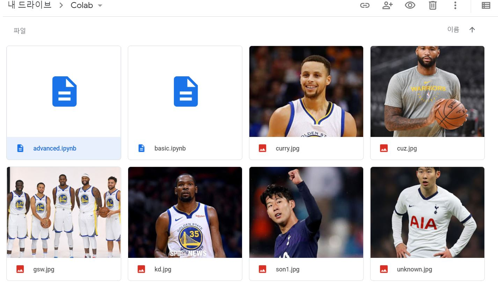
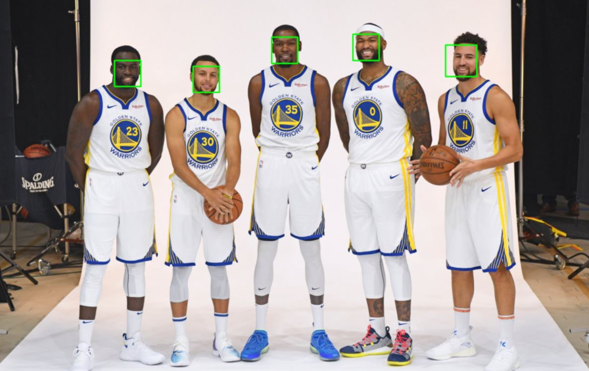
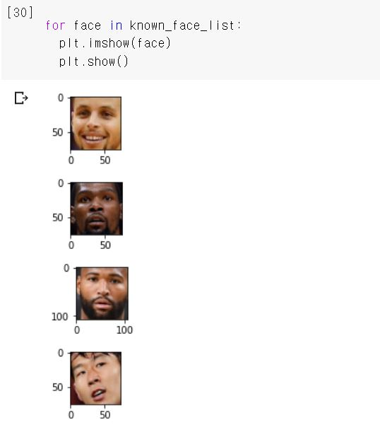
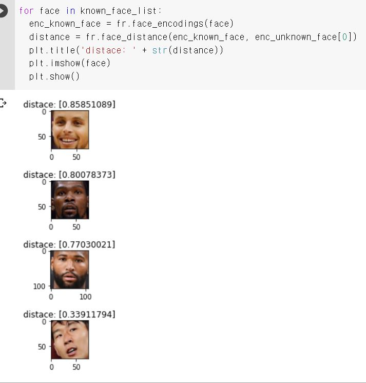

구글 드라이브에서 쥬피터노트북처럼 사용할 수 있는 Colab을 기반으로 과제를 진행하였다. 뼈대 파일인 advanced, basic파일에서 진행하였고, 단체사진으로 단체 얼굴인식, 개개인의 사진으로 개인 얼굴 인식을 경험해보았다.

* 단체사진

5명의 단체에서 각각의 얼굴을 인식할 수 있었다.

* 개개인의 사진을 known_face_list에 넣고 출력한 모습

* knwn_face_list의 사진과 손흥민의 사진을 비교했을 때

마지막의 손흥민 사진이 가장 근접하다는 것을 알 수 있다.

