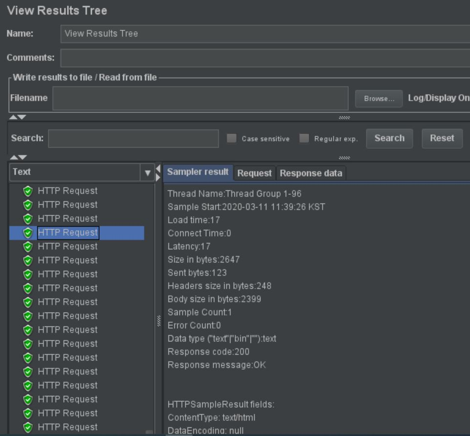
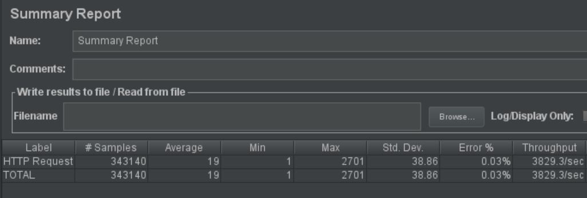
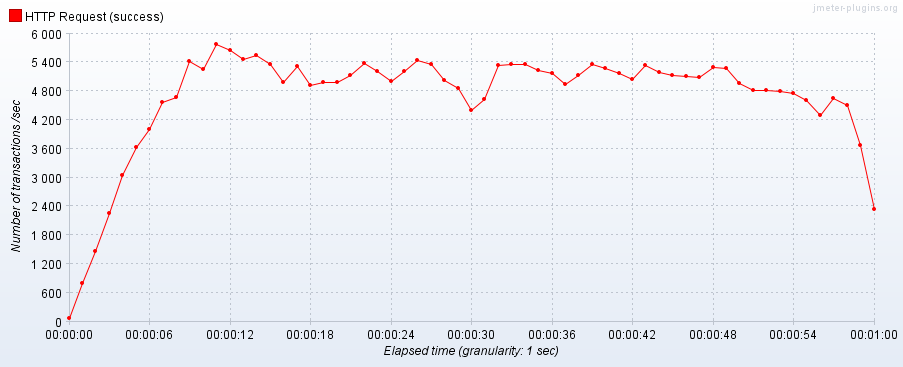

# JMeter로 수행하는 성능테스트

- 스파이크 테스트 - 한계점 확인할때 사용

- 신뢰성 테스트 - 한계 부하가 걸린상태에서 시스템의 모든 기능들이 어느정도 정상 운용되는지 테스트하는 것

  이 결과는 sw품질 특성 중 신뢰성을 나타내는 지표로 활용됨

**[View Results Tree]**

GET방식으로 요청한 http 주소. 성공하면 초록색, 실패했을 경우 빨간 방패가 뜬다.

**[Summary Report]**

- **Samples - 서버에 요청한 횟수**
- **Average - 평균 응답 시간 (ms)**
- **Min - 최소 응답 시간** **(ms)**
- **Max - 최대 응답 시간** **(ms)**
- **Error - 에러율** 
- **Throughput - 초당 처리 가능한 요청 횟수** 

**[TPS]**

Transaction Per Second

**[결과]**

총 시도 횟수 : 343140

평균 응답시간 : 19ms 

최소 응답시간 : 1ms 

최대 응답시간 : 2701ms 

에러율 : 0.03% 

초당 처리 가능한 요청 횟수 : 약 3829번