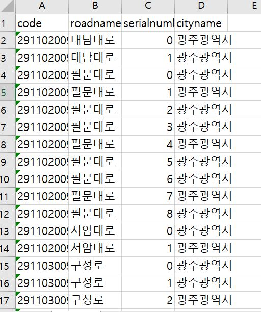
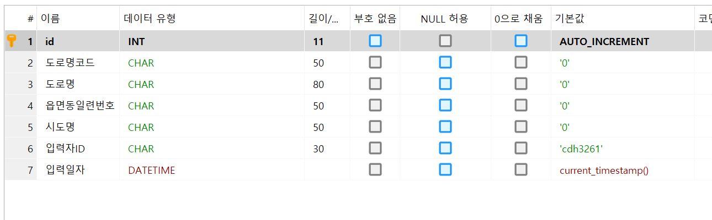
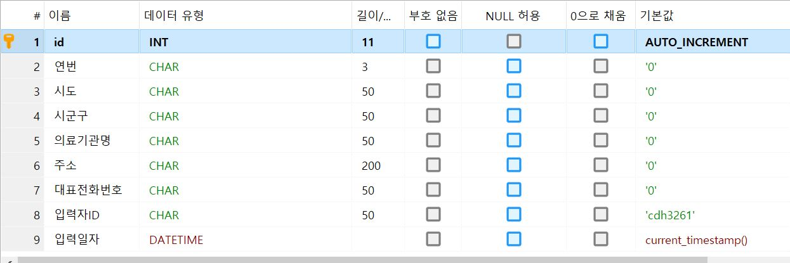
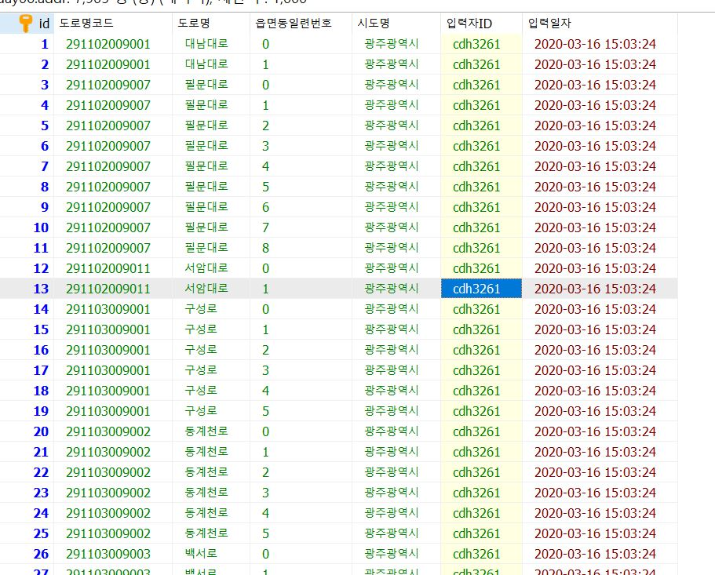
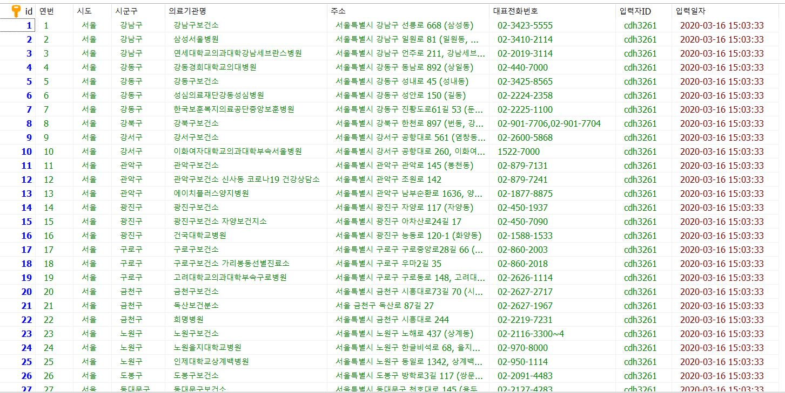

# Day06_DB데이터적재및가공

[1] 먼저 데이터를 엑셀에서 분류하였다. 도시명이 광주광역시만 필터로 적용!

[2-1] HeidiSQL에서 addr 테이블을 만들었다.

[2-2] medical 테이블

[3] 테이블에 csv 파일 데이터를 넣은 모습

많은 데이터를 분류해서 넣는 이론은 쉽게 다가왔지만 막상 해보려니 경험이 없어서 프로그램 활용하는

것이 어려웠다. 한번 해봤으니 다음부터는 쉽게 할 수 있을 것 같다.